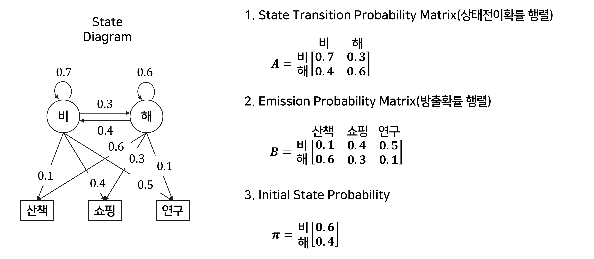
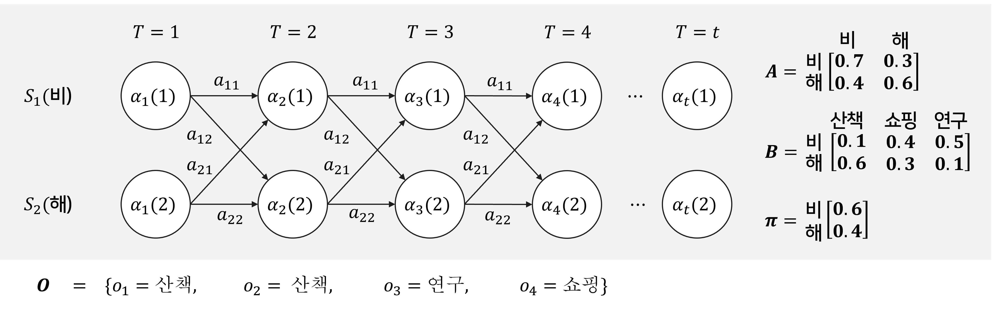

> **Reference** 
> * [핵심 머신러닝, Hidden Markov Model, 김성범[소장/인공지능연구소] 유튜브](https://youtu.be/HB9Nb0odPRs)
> * [은닉 마코프 모델, ratsgo 블로그](https://ratsgo.github.io/machine%20learning/2017/03/18/HMMs/)
---

# **Markov Chain**
* Markov Property를 가지는 이산 시간 확률과정
* 여기에서 상태(state)라는 용어가 등장하는데, Markov Property는 미래 상태는 현재 상태에 대한 조건부 확률이며 과거 상태와 미래 상태는 독립이라는 의미이다. 즉, 미래는 현재 상태에 의해서만 결정된다는 것이다.
* 가장 최근 $r$개의 상태에만 의존한다라고 했을 때, 
$r=1$이면 first order markov model, 
$r=2$이면 second order markov model이라고 한다. 

# **Hidden Markov Model(HMM)**
* 순차 데이터(Sequential data)를 Markov chain에 Hidden(은닉된) 상태를 이용한 모델이다.
* 각 시점마다 두 개의 순차 데이터가 있는데 그 중 하나를 관측할 수 있는(Observable) 상태라 하고 다른 하나를 은닉(Hidden)된 상태라고 하자. 관측할 수 있는 상태를 이용해서 관측되지 않았던 상태에 대해 추정하고 싶을 때 유용하다.
    * 관측 순차 데이터 : 빙수 매출 / 은닉 순차 데이터 : 날씨
* 이 모델에서 필요한 parameter는 $\boldsymbol{\lambda}=\{\mathbf{A},\mathbf{B},\boldsymbol{\pi}\}$이다. 
    1. $\mathbf{A}$ : State Transition Probability Matrix(상태전이확률 행렬)
        $$a_{ij} = \operatorname{P}(q_{t+1}=s_j\mid q_{t}=s_i)$$
        $t$시점에서 $i$번째 상태($s_i$)가 주어졌을 때, $t+1$시점에서 $j$번째 상태($s_{j}$)의 조건부 확률을 말한다. 
    2. $\mathbf{B}$ : Emission Probability Matrix(방출확률 행렬) 
        $$b_{j}(v_k) = \operatorname{P}(o_{t}=v_k\mid q_{t}=s_j)$$
        $t$시점에서 $j$번째 상태($s_j$)가 주어졌을 때, $v_k$가 관측될 조건부 확률을 말한다.
    3. $\boldsymbol{\lambda}$ : Initial State Probability(초기상태확률)

        

* 우리는 HMM으로 **세 가지**를 얻을 수 있다. 
    1. Parameter의 업데이트(EM Algorithm) $\rightarrow\;\text{HMM}(\boldsymbol{\lambda}^*)$ 
    : training data를 통해 최적의 파라미터를 추정할 수 있다.
    2. Evaluation(각 시점마다 관측될 확률) $\rightarrow \operatorname{P}(\mathbf{O}\mid \boldsymbol{\lambda}^*)$ 
    : 각 시점마다 관측된 값을 $\mathbf{O}=\{o_1, o_2, \cdots, o_T\}$라고 할 때, $P(\mathbf{O})$를 계산할 수 있다. 계산할 수 있는 방법에는 Forward Algorithm / Backward Algorithm이 있다.
    3. Decoding(각 시점의 Hidden State 확률) $\rightarrow \operatorname{P} (S\mid \mathbf{O},\boldsymbol{\lambda}^*)$ 
    : 각 시점의 Hidden State의 확률을 계산하고 어떤 상태였을지 추정할 수 있다.

# **Exercise : 직접 계산해보기**
* Hidden State : {비, 해} / Observable State : {산책, 쇼핑, 연구}
* 각 확률은 위의 그림과 같다. 
* $\mathbf{O}=\{o_1=산책, o_2=산책, o_3=연구, o_4=쇼핑\}$라고 하자.

## **Likelihood : $\operatorname{P}(\mathbf{O}\mid \boldsymbol{\lambda})$**
* 각 시점에서 Hidden 상태가 나올 경우가 각각 2가지이기 때문에 우리는 $2^4=16$개의 확률을 고려해서 이를 모두 더해야 한다.  
    ex. 비-비-비-비, 비-비-비-해, ..., 해-해-해-해
* 이를 확장하여 시점이 $T$까지 있고, 각 시점마다 나올 수 있는 상태가 $N$개 있다고 할 때, 우리는 $N^T$개의 확률을 고려해야 한다.  
$\rightarrow$ <u>$N$과 $T$가 클수록 너무 많은 확률을 고려해야 한다.</u>
* 이 문제를 Forward Algorithm / Backward Algorithm으로 해결할 수 있다. 

### **1) Forward Algorithm**

    

* $\alpha_t(j)=\operatorname{P}(o_1,o_2,\cdots,o_t,q_t=s_j\mid \boldsymbol{\lambda})$ 
    : $t$시점까지의 관측값이 ${o_1,o_2,\cdots,o_t}$이고, $t$시점의 상태가 $s_j$일 확률
* $\operatorname{P}(\mathbf{O}\mid\boldsymbol{\lambda})=\sum_{j=1}^J\alpha_t(j)$

$$\text{Goal} : \operatorname{P}(\mathbf{O})=\alpha_4(1) + \alpha_4(2)$$
* **STEP1. $T=1$**
$$
        \begin{aligned}
            \alpha_1(1) &= P(o_1=산책,q_1=비) = \pi_1\cdot b_1(산책) = 0.6\times 0.1=0.06\\
            \alpha_1(2) &= P(o_1=산책,q_1=해) = \pi_1\cdot b_2(산책) = 0.4\times 0.6=0.24
        \end{aligned}

$$

* **STEP1. $T=2$**
$$
        \begin{aligned}
            \alpha_2(1) &= P(o_1=산책,o_2=산책,q_2=비)\\
            &= (\alpha_1(1)\cdot a_{11}+\alpha_1(2)\cdot a_{21})\cdot b_{1}(산책)\\ 
            &= (0.06\cdot0.7+0.24\cdot0.4)\times 0.1
            =(0.042+0.096)\times 0.1=0.0138\\
            \alpha_2(2) &= P(o_1=산책,o_2=산책,q_2=해)\\
            &= (\alpha_1(1)\cdot a_{12}+\alpha_1(2)\cdot a_{22})\cdot b_{2}(산책)\\ 
            &= (0.06\cdot0.3+0.24\cdot0.6)\times 0.6
            =(0.018+0.144)\times 0.6=0.0972
        \end{aligned}

$$

풀이 과정 더 보기

    
    * **STEP1. $T=3$**
        $$
            \begin{aligned}
                \alpha_3(1) &= P(o_1=산책,o_2=산책,o_3=연구,q_2=비)\\
                &= (\alpha_2(1)\cdot a_{11}+\alpha_2(2)\cdot a_{21})\cdot b_{1}(연구)\\ 
                &= (0.06\cdot0.7+0.24\cdot0.4)\times 0.1
                =(0.042+0.096)\times 0.1=0.0138\\
                \alpha_3(2) &= P(o_1=산책,o_2=산책,o_3=연구,q_2=해)\\
                &= (\alpha_2(1)\cdot a_{12}+\alpha_2(2)\cdot a_{22})\cdot b_{2}(연구)\\ 
                &= (0.06\cdot0.3+0.24\cdot0.6)\times 0.6
                =(0.018+0.144)\times 0.6=0.0972
            \end{aligned}
        $$
    * **STEP1. $T=3$**
    $$
        \begin{aligned}
            \alpha_3(1) &= P(o_1=산책,o_2=산책,o_3=연구,q_2=비)\\
            &= (\alpha_2(1)\cdot a_{11}+\alpha_2(2)\cdot a_{21})\cdot b_{1}(연구)\\ 
            &= (0.06\cdot0.7+0.24\cdot0.4)\times 0.1
            =(0.042+0.096)\times 0.1=0.0138\\
            \alpha_3(2) &= P(o_1=산책,o_2=산책,o_3=연구,q_2=해)\\
            &= (\alpha_2(1)\cdot a_{12}+\alpha_2(2)\cdot a_{22})\cdot b_{2}(연구)\\ 
            &= (0.06\cdot0.3+0.24\cdot0.6)\times 0.6
            =(0.018+0.144)\times 0.6=0.0972
        \end{aligned}
    $$     

