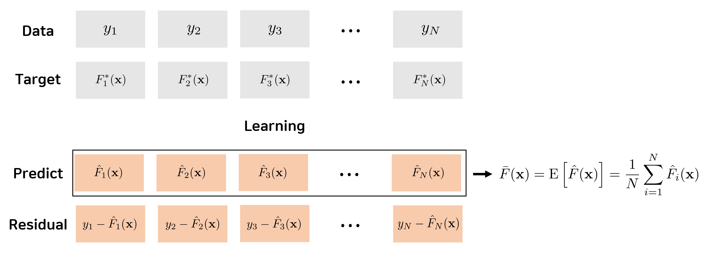
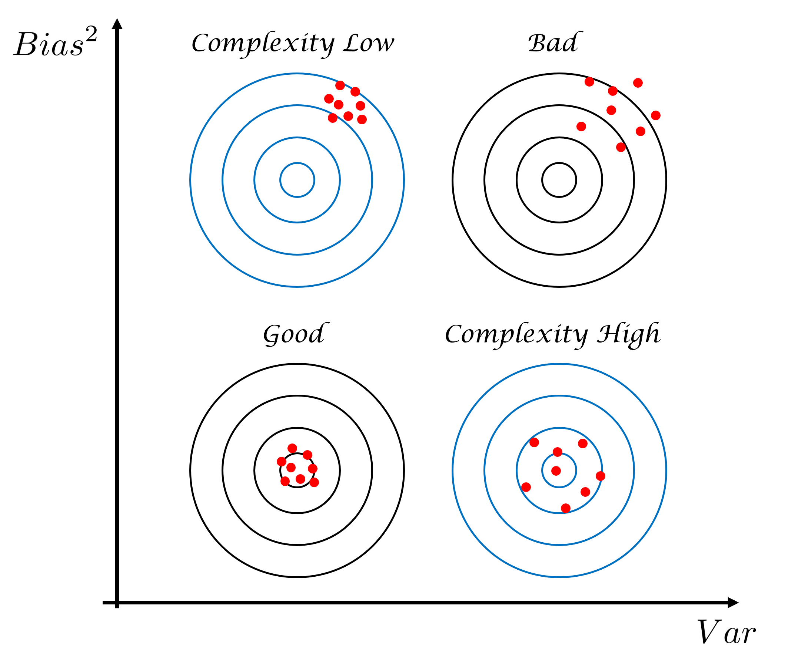
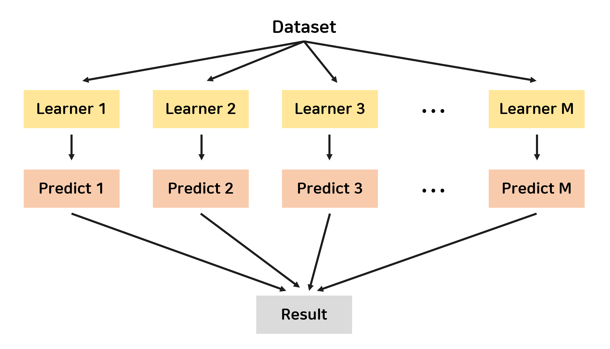

> **Reference**<br>
> * [Business Analytics Graduate, IME654, 고려대학교 산업경영공학부 DSBA 연구실 Youtube](https://youtube.com/playlist?list=PLetSlH8YjIfWMdw9AuLR5ybkVvGcoG2EW)
> * [Do we Need Hundreds of Classifiers to Solve Real World Classification Problems? <br> J. Mach. Learn. Res. 15, 1 (January 2014), 3133–3181.](https://dl.acm.org/doi/10.5555/2627435.2697065)
> * [No Free Lunch Theorems for Optimization, Wolpert D.H., Macready, W.G (1997)](https://ieeexplore.ieee.org/document/585893)
---

> ***NOTE***. 이 노트는 [고려대학교 산업경영공학부 DSBA 연구실 Youtube] 채널에서 강필성 교수님의 강의를 듣고 작성한 것이다.

# **1. No Free Lunch Theorem**
##  ***가장 우월한 알고리즘은 없다!*** 
* [No Free Lunch Theorems for Optimization(1997)](https://ieeexplore.ieee.org/document/585893)에서 나온 이론.
* 문제의 목적. 데이터의 형태 등 상황에 따라 우월한 알고리즘은 다르다.
* 즉, ***여러 알고리즘의 특성을 파악***하고, 상황에 맞게 사용하는 것이 매우 중요하다. 

## ***단일 모형보다는 여러 모형의 조합이 중요!***
* [Do we Need Hundreds of Classifiers to Solve Real World Classification Problems?](https://dl.acm.org/doi/10.5555/2627435.2697065)<br>
단일 모형보다 여러 모형의 조합이 성능이 더 좋다라는 것을 보이기 위해 대규모 실험을 통해 보여주었다. 
* 실험 대상 : 179개의 Algorithm X 121개의 Datasets
* 성능 지표  
    1. 각 Dataset마다 Algorithm의 성능의 순위를 매김
    2. 121개의 Datasets에 대한 성능 평균 순위를 계산
    3. 단일 모형과 여러 모형의 조합의 평균 성능 순위를 비교
* 결론
    * 순위가 1인 Algorithm은 존재하지 않는다. <br>
    $\rightarrow$ _어디서나 우월한 알고리즘은 없다_
    * Random Forest와 SVM계열이 상대적으로 분류 성능이 높았다. <br>
    $\rightarrow$ _단일 모형보다는 여러 모형의 조합이 더 우수함을 보인다._
* 한계 
    * 성능이 우수하다고 알려진 Boosting 계열의 알고리즘이 반영되지 않았다. 
    * 179개라는 알고리즘의 수는 과장된 것. <br>
    같은 알고리즘이더라도 다른 코드. 패키지를 사용하면 다른 알고리즘이라고 분류

그래도 이 논문에서 중요한 것은 단일 모형보다는 여러 모형의 조합이 더 우수하다는 것은 실험으로 증명되었다는 사실이다.

# **2. Bias-Variance Decomposition**

데이터는 Target Function 이외에 설명할 수 없는 오차 $\epsilon$가 포함되어 있다고 가정하는 모형을 'Additive error model'이라고 한다. 이때 $\epsilon$은 연구자가 컨트롤할 수 없는 자연적으로 발생하는 오차라고 해서 잡음(noise)라고도 부른다. 이를 수식으로 표현하면 다음과 같다.

데이터 $y$는 다음과 같이 표현된다고 하자. 

$$
    y = F^*(\mathbf{x}) + \epsilon,\quad \epsilon \overset{iid}{\sim}N(0, \sigma^2)
$$

* $y$ : Data
* $F^*(\mathbf{x})$ : Target function
* $\epsilon$ : Error or Noise


우리의 목표는 Target Function인 $F^*(\mathbf{x})$를 여러번 학습해서 정답인 $y$와 최대한 가깝게 다가가는 것이다. 이와 관련한 대표적인 성능 지표로 MSE(Mean Squared Error)가 있다. MSE를 편향(Bias)과 분산(Variance)으로 분해하여 그 중요성을 파악해보자.

먼저 Notation을 정리하면 다음과 그림과 같다. 

<div align='center'>

</div>


그리고 어떤 관측값 $\mathbf{x}_0$에 대한 MSE는 다음과 같이 예측값 $\hat{F}(\mathbf{x})$에 대한 편향의 제곱과 분산으로 분해할 수 있다. 

$\mathrm{E}(\epsilon)=0, \mathrm{E}(\epsilon^2)=\sigma^2$이므로 


```math
\begin{aligned}
    MSE(\mathbf{x}_0)
    &= \mathrm{E}\left[(y-\hat{F}(\mathbf{x}))^2\mid \mathbf{x}=\mathbf{x}_0 \right] \\ 
    &= \mathrm{E}\left[\left(F^*(\mathbf{x}_0)+\epsilon - \hat{F}(\mathbf{x}_0)\right)^2\right] \\ 
    &= \mathrm{E}\left[\left(F^*(\mathbf{x}_0) - \hat{F}(\mathbf{x}_0)\right)^2\right] + \sigma^2
\end{aligned}
```

$\mathrm{E}\left[F^*(\mathbf{x}_0) - \bar{F}(\mathbf{x}_0)\right]=0$ 이므로

```math
\begin{aligned}
    MSE(\mathbf{x}_0)
    &= \mathrm{E}\left[\left(F^*(\mathbf{x}_0) - \bar{F}(\mathbf{x}_0) + \bar{F}(\mathbf{x}_0) -\hat{F}(\mathbf{x}_0)\right)^2\right] + \sigma^2 \\    
    &= \mathrm{E}\left[\Big(F^*(\mathbf{x}_0) - \bar{F}(\mathbf{x}_0)\Big)^2\right] + 
    \mathrm{E}\left[\left(\bar{F}(\mathbf{x}_0) -\hat{F}(\mathbf{x}_0)\right)^2\right] + \sigma^2
\end{aligned}
```

$F^*(\mathbf{x}_0) - \bar{F}(\mathbf{x}_0)$는 상수이므로

```math
\begin{aligned}
    MSE(\mathbf{x}_0)
    &= \Big(F^*(\mathbf{x}_0) - \bar{F}(\mathbf{x}_0)\Big)^2 + 
    \mathrm{E}\left[\left(\bar{F}(\mathbf{x}_0) -\hat{F}(\mathbf{x}_0)\right)^2\right] + \sigma^2 \\     
    &= Bias^2\left(\hat{F}(\mathbf{x_0})\right) + Var\left(\hat{F}(\mathbf{x_0})\right) + \sigma^2
\end{aligned}
```

* $Bias^2\left(\hat{F}(\mathbf{x_0})\right)$ : 예측값의 평균 $\bar{F}(\mathbf{x})$ 이 Target Function인 $F^*(\mathbf{x})$와 얼마나 떨어져 있는가?
    * 즉, 예측값들의 평균이 정답을 잘 맞추는 편인가?
    * 편향의 제곱이 작다 $\rightarrow$ 정답을 맞출 가능성이 ***작다***.<br>
    편향의 제곱이 크다 $\rightarrow$ 정답을 맞출 가능성이 ***높다***.
* $Var\left(\hat{F}(\mathbf{x_0})\right)$ : 예측값 $\hat{F}(\mathbf{x})$들이 평균 $\bar{F}(\mathbf{x})$을 중심으로 어떻게 분포되어 있는가?
    * 즉, 예측값들이 모두 정답을 잘 맞추는 편인가?
    * 분산이 작다 $\rightarrow$ 대부분의 예측값들이 정답에 가깝다. <br>
    분산이 크다 $\rightarrow$ 몇몇의 예측값들은 정답과 멀다.
* ★★★ 편향의 제곱($Bias^2$)과 분산($Var$)은 trade-off 관계이다.
    * 가장 이상적인 결과만 나오면 좋겠지만, 대부분의 학습결과는 파란색 과녁의 경우가 많다. 아래의 그림은 가장 가운데가 정답이라고 했을 때의 예측값을 빨간색 점으로 표현한 것이다.
    * Complexity Low
        * 예측값들의 분산은 작으나 실제 값과의 차이는 큰 경우이다. 
        * 단순한 모형에서 많이 보이며, 과소적합(Underfit)이라고 하는데 학습데이터를 늘려 문제를 해결할 수 있다. 
        * Logistirc regression, LDA, KNN(large k) 등이 있다.
    * Complexity High
        * 실제 값을 가깝게 맞추지만 분산이 큰 경우이다. 
        * 복잡한 모형에서 많이 보이며, 과대적합(Overfit)이라고 하는데 검증데이터를 도입하여 문제를 해결할 수 있다. 
        * 학습에 있어서 가장 중요하게 고려해야하는 문제이다.
        * Decision Tree, NN, SVM, KNN(small k) 등이 있다.

    **따라서 우리는 편향의 제곱과 분산을 모두 최소화할 수 있는 지점을 찾을 수 있어야 한다.**

<div align='center'>

</div>


# **3. Ensemble이란?**

앞서 머신러닝에 대한 다양한 모델들에 대해 배웠었다. Ensemble의 Main Idea는 한 Dataset에 대해 다양한 모델들을 여러 번 사용해서 합치면 더 좋은 결과가 나오지 않을까?에서 시작한다. 

* 집단지성, 대수의 법칙과 관련이 있다. 
    * 집단지성(Collective Intelligence)? <br>
    다수의 개체들이 서로 협력 혹은 경쟁을 통하여 얻게 되는 결과이자 집단적 능력을 말한다.(참고. 위키백과)
    * 대수의 법칙(Law of Large Number)? <br>
    모집단에서 무작위로 뽑은 표본의 평균이 전체 모집단의 평균과 가까울 가능성이 높다는 통계와 확률 분야의 기본 개념(참고. 위키백과)


<div align='center'>

</div>

* Ensemble의 핵심 가치
    1. 얼마나 다양한 모델을 사용할 것인가? **<u>Diversity (다양성)</u>**
    2. 결과들을 어떻게 잘 합칠 것인가?

* Ensemble의 종류

    <table align='center'>
    <tr> <th></th><th style="text-align:center">Bagging</th> <th style="text-align:center">Boosting</th> </tr>
    <tr> <td><b>Diversity</b></td>
        <td>Implicit<br>
        각 Learner에 Dataset을 다르게 주면 결과도 달라질 것이다.</th> 
        <td>Explicit<br>
        측정 지표를 통해 이전 모델과 다른 모델이 만들어지도록 유도한다.</td> </tr>
    <tr> <td><b>처리방식</b></td>
        <td>Independent<br>병렬처리 가능</td> 
        <td>Sequential<br>순차적 처리 가능</td> </tr>
    <tr> <td><b>Model</b></td>
        <td>Bootstrap Aggregating</td> 
        <td>AdaBoost, Gradient Boost, XGBoost, LightBGM, CatBoost, ...</td></tr>
    </table>

# **4. Ensemble의 우수성**

단일 모형일 때와 Ensemble 모형일 때의 성능을 수식으로 알아보자. 각 Model 또는 Learner의 모형은 다음과 같이 표현된다.

```math
    y_m(\mathbf{x}) = f(\mathbf{x}) + \epsilon_m(\mathbf{x}),\quad m=1,2,\cdots,M
```

* **Single Model**
    * $m$번째 Model의 오차제곱의 평균 : 
    
```math
    \mathrm{E}\left[\epsilon_m(\mathbf{x})^2\right] 
    = \mathrm{E}\left[\left(y_m(\mathbf{x})-f(\mathbf{x})\right)^2\right]
```
    
    * $M$개의 Model에 대한 오차제곱의 평균
    
```math
    \begin{aligned}
    E_{Avg}
    = \dfrac{1}{M}\sum_{m=1}^M \mathrm{E}\left[\epsilon_m(\mathbf{x})^2\right] 
    \end{aligned}
```

* **Ensemble**
    * 가정 1. 각 Learner의 오차 평균은 0이다. $\quad\mathrm{E}\left[\epsilon_m(\mathbf{x})\right]=0$
    * 가정 2. Learner의 오차들은 서로 독립이다. $\quad\mathrm{E}[\epsilon_m(\mathbf{x})\epsilon_l(\mathbf{x})]=0\;(m\neq l)$
    * Ensemble Estimator

```math
    \dfrac{1}{M}\sum_{m=1}^M y_m(\mathbf{x})
```

    * 오차제곱의 평균

```math
    \begin{aligned}
    E_{Emsemble} 
    &= \mathrm{E}\left[\left(\dfrac{1}{M}\sum_{m=1}^M y_m(\mathbf{x})-f(\mathbf{x})\right)^2\right]\\
    &= \mathrm{E}\left[\left(\dfrac{1}{M}\sum_{m=1}^M \left(y_m(\mathbf{x})-f(\mathbf{x})\right)\right)^2\right]\\
    &= \mathrm{E}\left[\left(\dfrac{1}{M}\sum_{m=1}^M \epsilon_m(\mathbf{x})\right)^2\right]\\
    &= \dfrac{1}{M}E_{Avg}
    \end{aligned}
```
      
* 만약 가정 1, 2가 성립하지 않는다면?

    > **코시-슈바르츠 부등식(Cauchy-Shwarz inequality)**
    > $$ (a^2+b^2)(x^2+y^2) \geq (ax+by)^2$$

```math
    \begin{aligned}
        M\cdot \sum_{m=1}^M \epsilon_m(\mathbf{x})^2
        &=(1^2+1^2+\cdots+1^2)(\epsilon_1(\mathbf{x})^2+\epsilon_2(\mathbf{x})^2+\cdots+\epsilon_M(\mathbf{x})^2)\\
        &\geq \left(\epsilon_1(\mathbf{x})+\epsilon_2(\mathbf{x})+\cdots+\epsilon_M(\mathbf{x})\right)^2
        =\left(\sum_{m=1}^M \epsilon_m(\mathbf{x})\right)^2
    \end{aligned}
```

정리하면

```math
    \begin{aligned}
    M\cdot \sum_{m=1}^M \epsilon_m(\mathbf{x})^2
    &\geq \left(\sum_{m=1}^M \epsilon_m(\mathbf{x})\right)^2\\
    \dfrac{1}{M}\sum_{m=1}^M \epsilon_m(\mathbf{x})^2
    &\geq \left(\dfrac{1}{M}\sum_{m=1}^M \epsilon_m(\mathbf{x})\right)^2 \\
    \end{aligned}
```

```math
    \therefore \mathrm{E}_{Avg} \geq \mathrm{E}_{Ensemble}
```

오차제곱의 평균은 작을수록 성능이 좋다. <br>
따라서 가정이 성립하지 않더라도 단일 모형보다 여러 모형의 조합이 우수함을 증명할 수 있다. 


