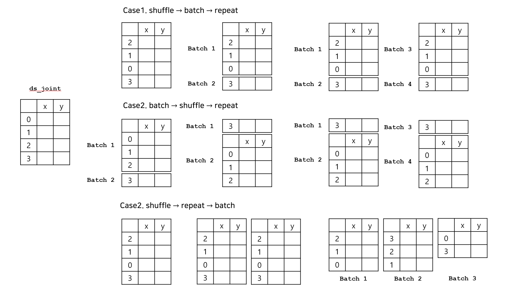

> **Reference**<br>
> * [머신러닝 교과서 with 파이썬, 사이킷런, 텐서플로 개정3판](https://github.com/gilbutITbook/080223)
---

# **데이터셋 생성**
## **1) 생성 : `tf.data.Dataset.from_tensor_slices()`**
* Tensor가 모여 데이터셋이 된다. 즉, 요소 하나하나가 모두 `tf.Tensor()`이다. 

```python
ds = tf.data.Dataset.from_tensor_slices(np.arange(5))
for row in ds:
    print(row)

## Output
## tf.Tensor(0, shape=(), dtype=int64)
## tf.Tensor(1, shape=(), dtype=int64)
## tf.Tensor(2, shape=(), dtype=int64)
## tf.Tensor(3, shape=(), dtype=int64)
## tf.Tensor(4, shape=(), dtype=int64)
```

## **2) 연결**
* tuple로 연결이 가능하며, 일대일 대응이 되어야 한다.

```python
# Method 1
tf.random.set_seed(1)
t_x = tf.data.Dataset.from_tensor_slices(tf.random.uniform((4, 3)))
t_y = tf.data.Dataset.from_tensor_slices(tf.range(4))

ds_joint = tf.data.Dataset.zip((t_x, t_y))
for r_x, r_y in ds_joint:
    print(f'x : {r_x}, y: {r_y}')

print('-'*60)

# Method 2
tf.random.set_seed(1)
t_x = tf.random.uniform((4, 3))
t_y = tf.range(4)

ds_joint = tf.data.Dataset.from_tensor_slices((t_x, t_y))
for r_x, r_y in ds_joint:
    print(f'x : {r_x}, y: {r_y}')

## Output
## x : [0.16513085 0.9014813  0.6309742 ], y: 0
## x : [0.4345461  0.29193902 0.64250207], y: 1
## x : [0.9757855  0.43509948 0.6601019 ], y: 2
## x : [0.60489583 0.6366315  0.6144488 ], y: 3
## ------------------------------------------------------------
## x : [0.16513085 0.9014813  0.6309742 ], y: 0
## x : [0.4345461  0.29193902 0.64250207], y: 1
## x : [0.9757855  0.43509948 0.6601019 ], y: 2
## x : [0.60489583 0.6366315  0.6144488 ], y: 3
```

## **3) 변환**
* `map()`함수를 통해 기존의 데이터셋을 변형시킬 수 있다.
* 연산 시 dtype에 주의해야 한다.<br>
예를 들어 dtype=tf.int32인데 float인 +1.0을 할 수 없다.

```python
ds_map = ds_joint.map(lambda x, y: (x + 1.0, y - 1))
for r_x, r_y in ds_map:
    print(f'x : {r_x}, y: {r_y}')

## Output
## x : [1.1651309 1.9014813 1.6309742], y: -1
## x : [1.4345461 1.291939  1.6425021], y: 0
## x : [1.9757855 1.4350995 1.6601019], y: 1
## x : [1.6048958 1.6366315 1.6144488], y: 2
```


## **3) shuffle / batch / repeat**
★ **진행 순서** : shuffle $\rightarrow$ batch $\rightarrow$ repeat

### **batch `dataset.batch(num, drop_remainder=True/False)`**<br>대량의 데이터에 대한 연산을 하기에는 비용이 많이 발생하기 때문에 배치(batch)로 나누어 학습시킨다. 
* 데이터셋을 `num`개씩 나눈다.
* `drop_remainder` : 배치가 나누어 떨어지지 않을 때 마지막 배치를 포함할지의 여부

```python
# 위의 ds_joint 데이터셋(4행)을 batch=3으로 나눈다. -> 3 / 1
# drop_remainder=False, 1행으로 이루어진 마지막 배치 데이터셋을 포함시킨다.
ds_batch = ds_joint.batch(batch_size=3, drop_remainder=False)
for i, (batch_x, batch_y) in enumerate(ds_batch,1):
    print(f'batch {i} drop_reamainder = False')
    print(f'x\n{batch_x}')
    print(f'y\n{batch_y}')

print('-' * 60)

# drop_remainder=True, 1행으로 이루어진 마지막 배치 데이터셋을 포함시키지 않는다.
ds_batch = ds_joint.batch(batch_size=3, drop_remainder=True)
for i, (batch_x, batch_y) in enumerate(ds_batch,1):
    print(f'batch {i} drop_reamainder = True')
    print(f'x\n{batch_x}')
    print(f'y\n{batch_y}')

### Output
## <batch 1> drop_reamainder = False
## x
## [[0.16513085 0.9014813  0.6309742 ]
##  [0.4345461  0.29193902 0.64250207]
##  [0.9757855  0.43509948 0.6601019 ]]
## y
## [0 1 2]
## <batch 2> drop_reamainder = False
## x
## [[0.60489583 0.6366315  0.6144488 ]]
## y
## [3]
## ------------------------------------------------------------
## <batch 1> drop_reamainder = True
## x
## [[0.16513085 0.9014813  0.6309742 ]
##  [0.4345461  0.29193902 0.64250207]
##  [0.9757855  0.43509948 0.6601019 ]]
## y
## [0 1 2]
```

### **shuffle `dataset.shuffle(buffer_size=num)`**<br>데이터셋이 label 순으로 정렬되어 있는 경우 배치(batch)로 나누었을 때 label이 치우져져 있는 문제 발생. 이를 해결하기 위해 데이터셋을 섞는 shuffle이 필요하다. 
* `buffer_size` : `num`개의 원소를 뽑아서 섞는다. 만약 `num`을 작게 설정하면 잘 섞이지 않는다.

```python
# buffer_size = 1
tf.random.set_seed(1)
ds_shuffle = ds_joint.shuffle(buffer_size = 1)
for r_x, r_y in ds_shuffle:
    print(f'x : {r_x}, y: {r_y}')

print('-' * 60)

# buffer_size = 전체 원소의 개수
tf.random.set_seed(1)
ds_shuffle = ds_joint.shuffle(buffer_size = len(t_x))
for r_x, r_y in ds_shuffle:
    print(f'x : {r_x}, y: {r_y}')

#### Output
## x : [0.16513085 0.9014813  0.6309742 ], y: 0
## x : [0.4345461  0.29193902 0.64250207], y: 1
## x : [0.9757855  0.43509948 0.6601019 ], y: 2
## x : [0.60489583 0.6366315  0.6144488 ], y: 3
## ------------------------------------------------------------
## x : [0.9757855  0.43509948 0.6601019 ], y: 2
## x : [0.4345461  0.29193902 0.64250207], y: 1
## x : [0.16513085 0.9014813  0.6309742 ], y: 0
## x : [0.60489583 0.6366315  0.6144488 ], y: 3
```

### **repeat**<br>딥러닝은 대량의 데이터를 여러번 학습하는데에 있다. 학습 횟수를 epoch라고 하는데 이를 위해 데이터를 반복하는 repeat가 필요하다.

```python
ds_repeat = ds_joint.repeat(count=2)
for r_x, r_y in ds_repeat:
    print(f'x : {r_x}, y: {r_y}')

## Output
## x : [0.16513085 0.9014813  0.6309742 ], y: 0
## x : [0.4345461  0.29193902 0.64250207], y: 1
## x : [0.9757855  0.43509948 0.6601019 ], y: 2
## x : [0.60489583 0.6366315  0.6144488 ], y: 3
## x : [0.16513085 0.9014813  0.6309742 ], y: 0
## x : [0.4345461  0.29193902 0.64250207], y: 1
## x : [0.9757855  0.43509948 0.6601019 ], y: 2
## x : [0.60489583 0.6366315  0.6144488 ], y: 3
```

### ★ **순서가 중요한 이유**
* 순서에 따라 결과가 매우 다르다.
* 데이터셋을 여러번 반복해서 학습하기 위해서는 Case1이 가장 적절하다. <br>1) 데이터를 섞는다 2) 배치로 나눈다 3) 전체 데이터를 반복한다

<div style="text-align:center">
    
</div>


```python
# ds_joint : 4행 
## Case 1 : shuffle -> batch(3) -> repeat
tf.random.set_seed(1)
ds_repeat = ds_joint.shuffle(len(t_x)).batch(3).repeat(count=2)
for i, (batch_x, batch_y) in enumerate(ds_repeat,1):
    print(f'batch {i} > x: {batch_x.shape}, y: {batch_y.shape}')

print('-' * 60)

## Case 2 : batch(3) -> shuffle -> repeat
ds_repeat = ds_joint.batch(3).shuffle(len(t_x)).repeat(count=2)
for i, (batch_x, batch_y) in enumerate(ds_repeat,1):
    print(f'batch {i} > x: {batch_x.shape}, y: {batch_y.shape}')

print('-' * 60)

## Case 3: shuffle -> repeat -> batch(3)
ds_repeat = ds_joint.shuffle(len(t_x)).repeat(count=2).batch(3)
for i, (batch_x, batch_y) in enumerate(ds_repeat,1):
    print(f'batch {i} > x: {batch_x.shape}, y: {batch_y.shape}')

## Output
## batch 1 > x: (3, 3), y: (3,)
## batch 2 > x: (1, 3), y: (1,)
## batch 3 > x: (3, 3), y: (3,)
## batch 4 > x: (1, 3), y: (1,)
## ------------------------------------------------------------
## batch 1 > x: (1, 3), y: (1,)
## batch 2 > x: (3, 3), y: (3,)
## batch 3 > x: (1, 3), y: (1,)
## batch 4 > x: (3, 3), y: (3,)
## ------------------------------------------------------------
## batch 1 > x: (3, 3), y: (3,)
## batch 2 > x: (3, 3), y: (3,)
## batch 3 > x: (2, 3), y: (2,)
```

# **데이터셋 불러오기**

```python
import tensorflow_datasets as tfds

print(f'tensorflow에 내장된 dataset : {len(tfds.list_builders())}개')
for i, data in enumerate(tfds.list_builders(),1):
    print(f'{i}. {data}')
    if i == 5:
        break

## Output
## tensorflow에 내장된 dataset : 1139개
## 1. abstract_reasoning
## 2. accentdb
## 3. aeslc
## 4. aflw2k3d
## 5. ag_news_subset
```

## **Method 1 : `builder()`**
1. `builder=tfds.builder()` : 데이터 호출
2. `builder.download_and_prepare()` : 데이터 다운로드
3. `builder.as.dataset(shuffle_files=True/False)` : 데이터셋 생성

```python
# CelebA 데이터셋을 불러온다고 하자. 

## STEP1. 데이터 호출
celebA_bldr = tfds.builder('celeb_a')
celebA_bldr.info                # 데이터셋의 정보 출력
celebA_bldr.info.features       # 데이터셋에 사용된 변수 설명

## STEP2. 데이터 다운로드
celebA_bldr.download_and_prepare(download_dir='path')

## STEP3. 데이터셋 생성(train, test 데이터를 나눈 데이터셋)
celebA_ds = celebA_bldr.as_dataset(shuffle_files=False)
```

## **Method 2 : `load()`**

```python
celebA, celebA_info = tfds.load('CelebA', with_info=True, shuffle_files=True)
celebA                     # 데이터셋 생성(train, test 데이터를 나눈 데이터셋)
celebA_info                # 데이터셋의 정보 출력
celebA_info.features       # 데이터셋에 사용된 변수 설명
```