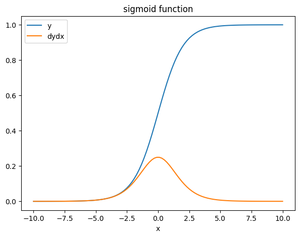

> **Reference**<br>
> * [머신러닝 교과서 with 파이썬, 사이킷런, 텐서플로 개정3판](https://github.com/gilbutITbook/080223)
> * [TensorFlow 가이드](https://www.tensorflow.org/guide?hl=ko)
> * [Tensorflow `tf.GradientTape()` GitHub](https://github.com/tensorflow/tensorflow/blob/v2.5.0/tensorflow/python/eager/backprop.py#L731-L1342)
---

# **`tf.GradientTape()`**
* trainable한 변수에 대해 자동으로 미분을 계산한다.
* 중첩된 함수를 계산하기 위해 연쇄 법칙(Chain rule)을 구현한 것<br>(후진 모드 자동 미분을 사용한다)
> **Chain Rule(연쇄법칙)**<br>
반복적으로 얻은 그레디언트를 누적하여 계산한다.

$$
        z = f(y),\quad y = g(w),\quad w = h(x)\\
        \begin{aligned}
            \dfrac{dz}{dx} 
            &= \dfrac{dz}{dy}\cdot\dfrac{dy}{dw}\cdot\dfrac{dw}{dx}\\
            &= \dfrac{dz}{dy}\cdot\left(\dfrac{dy}{dw}\cdot\dfrac{dw}{dx}\right)\quad \text{전진 모드}\\
            &= \left(\dfrac{dz}{dy}\cdot\dfrac{dy}{dw}\right)\cdot\dfrac{dw}{dx}\quad \text{후진 모드}\\
        \end{aligned} 
$$

* Options
    * `persistent=True/False`<br>
    Default는 하나의 그레디언트 계산을 위한 자원만 유지한다. 만약 여러 개의 그레디언트 계산이 필요하다면 `persistent=True`옵션을 추가해야 한다.
    * `watch_accessed_variables=True/False`<br>
    기본적으로 variable이 훈련가능한 변수(trainable)면 자동으로 추적할 대상으로 인식한다. 그러나 이를 사용하고 싶지 않다면 `watch_accessed_variables=False` 옵션을 추가해야 한다. 


## **1) 기본 구조**
* **STEP1.** 입력 변수 `x=tf.Variabe()` 정의(trainable해야 한다.)
* **STEP2.** `with tf.Gradient() as tape:`를 통해 자동 그레디언트 시작
* **STEP3.** `tape.watch(x)`를 통해 추적할 변수를 설정
* **STEP4.** 미분할 함수 `y` 정의
* **STEP5.** `tape.gradient(y, x)`를 통해 미분

**EX 1.** $y=x^2$일 때 $x=5$에서의 $\dfrac{dy}{dx}$를 구하자.
$$
    \dfrac{dy}{dx} = 2x \quad\longrightarrow\quad 2 \times 3 = 6
$$

```python
x = tf.Variable(5, dtype=tf.float32)        # STEP1 입력 변수 정의

with tf.GradientTape() as tape:             # STEP2 GradientTape 생성
    tape.watch(x)                           # STEP3 trainable할 변수 설정
    y = x ** 2                              # STEP4 미분할 함수 정의
dydx = tape.gradient(y, x)                  # STEP5 미분

print(dydx)     ## tf.Tensor(10.0, shape=(), dtype=float32)
```

**EX 2.** $y=x^2$일 때 $x=5$에서의 $\dfrac{d^2y}{dx^2}$를 구하자.

$$
    \dfrac{dy}{dx} = 2x \quad\longrightarrow\quad 2 \times 3 = 6\\
    \dfrac{d^2y}{dx^2} = 2
$$

```python
x = tf.Variable(3, dtype=tf.float32)

with tf.GradientTape() as tape:
    tape.watch(x)
    with tf.GradientTape() as tape2:
        tape2.watch(x)
        y = x ** 2
    dydx = tape2.gradient(y, x)      # 들여쓰기 했을 때
dydx2 = tape.gradient(dydx, x)

print(dydx)     ## tf.Tensor(6.0, shape=(), dtype=float32)
print(dydx2)    ## tf.Tensor(2.0, shape=(), dtype=float32)
```

**:question: dydx를 두번째 미분 with 바깥에 위치시키면?**

```python
x = tf.Variable(3, dtype=tf.float32)

with tf.GradientTape() as tape:
    tape.watch(x)
    with tf.GradientTape() as tape2:
        tape2.watch(x)
        y = x ** 2
dydx = tape2.gradient(y, x)          # 들여쓰기 안했을 때
dydx2 = tape.gradient(dydx, x)

print(dydx)     ## tf.Tensor(6.0, shape=(), dtype=float32)
print(dydx2)    ## None
```

**EX 3. $y=x^2,\;z=w^3$일 때 $x=5, w=3$에서의 $\dfrac{dy}{dx},\dfrac{dz}{dw}$를 구하자.** 

$$
    \begin{aligned}
        \dfrac{dy}{dx} = 2x &\quad\longrightarrow\quad 2 \times 5 = 10\\
        \dfrac{dz}{dw} = 3w^2 &\quad\longrightarrow\quad 3 \times 9 = 27
    \end{aligned}
$$

```python
x = tf.Variable(2, dtype=tf.float32)
w = tf.Variable(5, dtype=tf.float32)

with tf.GradientTape(persistent=True) as tape:
    tape.watch(x)
    tape.watch(w)
    y = x ** 2
    z = w ** 3
dydx = tape.gradient(y, x)
dzdw = tape.gradient(z, w)

print(dydx)     ## tf.Tensor(10.0, shape=(), dtype=float32)
print(dzdw)     ## tf.Tensor(27.0, shape=(), dtype=float32)
```

**EX 4.**  $z=y^2,\;y=x^3$일 때 $x=3$에서의 $\dfrac{dz}{dx}$를 구하자.

$$
    \begin{aligned}
        \dfrac{dz}{dy} = 2y = 2x^3 &\quad\longrightarrow\quad 2 \times 27 = 54\\
        \dfrac{dy}{dx} = 3x^2 &\quad\longrightarrow\quad 3 \times 9 = 27
    \end{aligned}\\
    \dfrac{dz}{dx}=\dfrac{dz}{dy}\cdot\dfrac{dy}{dx}=54\times 27 = 1458
$$

```python
x = tf.Variable(3, dtype=tf.float32)

with tf.GradientTape(persistent=True) as tape:
    tape.watch(x)
    y = x ** 2
    z = y ** 3
dzdx = tape.gradient(z, x)
dydx = tape.gradient(y, x)

print(dzdx)     ## tf.Tensor(1458.0, shape=(), dtype=float32)
print(dydx)     ## tf.Tensor(27.0, shape=(), dtype=float32)
```

## **2) 미분 여러 개 한꺼번에 실행하기**
* **STEP5**의 `tape.gradient()`를 통해 미분을 실행하는데 여러 변수에 대한 미분 결과를 한꺼번에 얻고 싶을 때 다음과 같이 표현할 수 있다. 
1. `tape.gradient(f, [var1, var2])`
2. `tape.gradient(f, {'var1':var2, 'var2':var2})`

**EX 5.**  $z = (x^2 + 2y)^2$일 때 $x=2, y=3$에서의 $\dfrac{dz}{dx}, \dfrac{dz}{dy}$를 구하자.

$$
    \begin{aligned}
        \dfrac{dz}{dx} = 2(x^2+2y)\times 2x = 2\times(4+6)\times4 = 80\\
        \dfrac{dz}{dy} = 2(x^2+2y)\times 2 = 2\times(4+6)\times2 = 40
    \end{aligned}
$$

```python
x = tf.Variable(2, dtype=tf.float32)
y = tf.Variable(3, dtype=tf.float32)

with tf.GradientTape(persistent=True) as tape:
    tape.watch(x)
    tape.watch(y)
    z = (x**2 + 2*y)**2

# Method 1 : List
dzdx, dzdy = tape.gradient(z, [x, y])

print(dzdx)             ## tf.Tensor(80.0, shape=(), dtype=float32)
print(dzdy)             ## tf.Tensor(40.0, shape=(), dtype=float32)

# Method 2 : Dictionary
my_vars = {'x': x, 'y': y}
grad = tape.gradient(z, my_vars)
print(grad['x'])        ## tf.Tensor(80.0, shape=(), dtype=float32)
print(grad['y'])        ## tf.Tensor(40.0, shape=(), dtype=float32)
```

**EX 6.** 시그모이드 함수($y=1/(1+e^{-x})$)의 미분을 그래프로 표현해보자.

```python
x = tf.linspace(-10, 10, 100)

with tf.GradientTape() as tape:
    tape.watch(x)
    y = tf.nn.sigmoid(x)

dydx = tape.gradient(y, x)

# draw plot
import matplotlib.pyplot as plt

fig, ax = plt.subplots(figsize=(7, 5))
ax.plot(x, y, label='y')
ax.plot(x, dydx, label='dydx')
ax.set(xlabel='x',title='sigmoid function')
ax.legend()

plt.show()
```

<div style="text-align:center">
    
</div>

## **3) 스칼라가 아닌 대상 미분하기**
* 각 요소에 대한 미분 계산값의 ***합***으로 표현된다.

**EX 7.** $\mathbf{y}=\begin{bmatrix}2x & x^3 & -x^2+5x\end{bmatrix}$일 때 $x=3$에서의 $\nabla\mathbf{y}$를 구한 후 각 요소의 합을 구하자.

$$
    \mathbf{y}=\begin{bmatrix}2x & x^3 & -x^2+5x\end{bmatrix}\\
    \nabla\mathbf{y} = \dfrac{\partial \mathbf{y}}{\partial x}
    =\begin{bmatrix}2 & 3x^2 & -2x+5\end{bmatrix}
    \quad\longrightarrow\quad
    \begin{bmatrix}2 & 27 & -1\end{bmatrix}
$$

```python
# Method 1. Dictionary
x = tf.Variable(3, dtype=tf.float32)

with tf.GradientTape() as tape:
    tape.watch(x)
    y1 = 2*x
    y2 = x**3
    y3 = -x**2+5*x

dydx = tape.gradient({'y1':y1, 'y2':y2, 'y3':y3}, x)
print(dydx)     ## tf.Tensor(28.0, shape=(), dtype=float32)

# Method 2. List
dydx = tape.gradient([y1, y2, y3], x)
print(dydx)     ## tf.Tensor(28.0, shape=(), dtype=float32)

# Method 3. List
x = tf.Variable(3, dtype=tf.float32)

with tf.GradientTape() as tape:
    tape.watch(x)
    y = [2*x, x**3, -x**2+5*x]

dydx = tape.gradient(y, x)
print(dydx)     ## tf.Tensor(28.0, shape=(), dtype=float32)
```

## **4) 주의할 점**

**:exclamation: `tape.watch(x)`의 생략**<br>
trainable한 변수 한 개에 대한 미분을 계산할 때에는 자동으로 인식하기 때문에 쓰지 않아도 된다. ***하지만***, 두 개 이상의 미분 계산이 필요할 때에는 `persistent=True`와 함께 `tape.watch()`로 추적할 변수를 설정해주어야 한다.(EX 3, 4 참고)

```python
# trainable하지 않은 변수의 경우 자동으로 인식하지 않는다.
x = tf.Variable(5, dtype=tf.float32, trainable=False)
with tf.GradientTape() as tape:
    y = x ** 2
dydx = tape.gradient(y, x)

print(dydx)     ## None
```

**:exclamation: `watch_accessed_variables=False`**<br>
`tape.watch(x)`를 자동으로 인식하지 않게 한다. 

```python
x = tf.Variable(5, dtype=tf.float32)

with tf.GradientTape(watch_accessed_variables=False) as tape:
    y = x ** 2
dydx = tape.gradient(y, x)

print(dydx)     ## None
```

**:exclamation: 미분할 대상은 반드시 변수여야 한다.**<br>
변수 값 업데이트는 `assign()/assign_add()/assign_sub()`를 통해 이뤄져야 한다. 그렇지 않으면 variable은 tensor로 type이 바뀌게 된다.

```python
x1 = tf.Variable(2, dtype=tf.float32)
x2 = x1 + 1

with tf.GradientTape(persistent=True) as tape:
    y = x1 ** 3 + x2 **3

dydx1 = tape.gradient(y, x1)
dydx2 = tape.gradient(y, x2)

print(f'type={type(x1).__name__},\t x={x1.numpy()},\t  dydx={dydx1}')
print(f'type={type(x2).__name__},\t x={x2.numpy()},\t  dydx={dydx2}')

## Output
## type=ResourceVariable,	 x=2.0,	  dydx=12.0
## type=EagerTensor,	     x=3.0,	  dydx=None
```

**:exclamation: 변수의 dtype은 float여야 한다.**<br>
dtype을 따로 입력하지 않으면 `int32`로 인식하게 되는데 이 경우 미분이 제대로 되지 않아 `None`을 반환한다. 반드시 `dtype=tf.float32`옵션을 추가하거나 `tf.Variable(2.0)`과 같이 실수임을 표현해야 한다.

```python
x = tf.Variable(2)

with tf.GradientTape() as tape:
    y = x ** 4 

dydx = tape.gradient(y, x)

print(f'type={type(x).__name__},\t x={x.numpy()},\t  dydx={dydx}')

## Output
## type=ResourceVariable,	 x=2,	  dydx=None
```

**:exclamation: 연결되지 않는 변수의 경우 출력을 0으로 바꿀 수 있다.**<br>
함수에 포함되어 있지 않은 변수를 미분하려고 할 때 `None`을 반환하게 되는데, `unconnected_gradients=tf.UnconnectedGradients.ZERO` 옵션을 이용하여 이를 0으로 대체 출력할 수 있게 할 수 있다. 

```python
x = tf.Variable([2., 2.])
y = tf.Variable(3.)

with tf.GradientTape(persistent=True) as tape:
  z = y**2

print(tape.gradient(z, x))
print(tape.gradient(z, x, unconnected_gradients=tf.UnconnectedGradients.ZERO))

## Output
## None
## tf.Tensor([0. 0.], shape=(2,), dtype=float32)
```