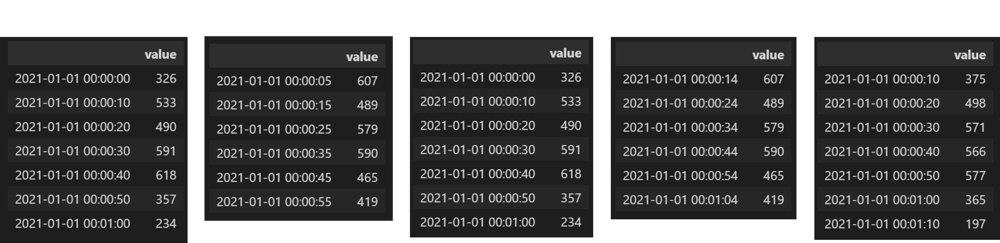

> **Reference**<br>
> * 시계열 데이터 분석 with 파이썬 강의(Jose Portilla, Udemy)
> * [Python 완전정복 시리즈 2편](https://wikidocs.net/158101)
---

# **1. Resample**
* `dataframe.resample(rule, options)`

    <table style="width:90%">
        <tr>
            <th style="width:10%; font-weight:bold">option</th>
            <th style="width:90%; font-weight:bold">설명</th>      
        </tr>
        <tr>
            <td>rule</td>
            <td>재조정할 간격 기준(년, 월, 일, 시간) ex.'Y, M, D, H, T, S, ...</td>
        </tr>
        <tr>
            <td>axis</td>
            <td>0 or 1(default: 0), 축 기준</td>
        </tr>
        <tr>
            <td>close</td>
            <td>left or right(default: left), 어느 쪽을 닫을 것인가?<br>
                ex. a<=x&lt; b(left), a&lt; x<=b(right)</td>
        </tr>
        <tr>
            <td>label</td>
            <td>left or right(default: left), index이름을 무엇으로 할 것인가?<br>
                ex. 간격 a<=x&lt; b인 경우 left: a / right: b</td>
        </tr>
        <tr>
            <td>origin</td>
            <td>시작 기준점.
                <ul>
                    <li>start_day(default) : 처음 값의 00:00:00</li>
                    <li>start : 처음 값</li>
                    <li>epoch : 1970-01-01</li>
                    <li>end : 끝 값</li>
                    <li>end_day : 끝 값의 자정 00:00:00</li>
                </ul>
            </td>
        </tr>
        <tr>
            <td>offset</td>
            <td>origin의 값에 offset을 더한 값을 기준으로 진행된다.</td>
        </tr>
        <tr>
            <td>...</td>
            <td>...</td>
        </tr>
    </table>
    &nbsp;

* Datatime의 간격을 재조정하는 함수
* `.sum(), .mean(), ...`등을 통해 주기(년, 월, 주 등)별로 요약할 수 있다.

## **origin option**

* 2021-01-01 00:00:05 부터 2021-01-01 00:01:04 까지 0이상 100이하의 값이 랜덤으로 되어 있는 데이터가 있다고 하자.
    <details>
    <summary>데이터 생성 코드</summary>
    <div markdown="1" style="font-size:10pt">                  
    
    ```python   
    import pandas as pd
    from random import randint

    index = pd.date_range('2021-01-01 00:00:05', periods=60, freq='S')
    value = [randint(0,100) for _ in range(60)]
    data = pd.DataFrame({'value':value}, index=index)
    data
    ```
    
    </div>
    </details>
    &nbsp;
* Output
    <details>
    <summary>resample 코드</summary>
    <div markdown="1" style="font-size:10pt">                  
    
    ```python   
    data.resample(rule='10S', origin='start_day').sum()
    data.resample(rule='10S', origin='start').sum()
    data.resample(rule='10S', origin='epoch').sum()
    data.resample(rule='10S', origin='end').sum()
    data.resample(rule='10S', origin='end_day').sum()
    ```
    
    </div>
    </details>
    
    

# **2. Rolling**

* `dataframe.rolling(window, options)`

    <table style="width:90%">
        <tr>
            <th style="width:10%; font-weight:bold">option</th>
            <th style="width:90%; font-weight:bold">설명</th>      
        </tr>
        <tr>
            <td>window</td>
            <td>계산할 창의 크기</td>
        </tr>
        <tr>
            <td>min_periods</td>
            <td>계산할 최소 크기.(default: window와 같다)<br>min_periods > window면 NaN으로 출력된다.</td>
        </tr>
        <tr>
            <td>win_type</td>
            <td>가중치(triang / gaussian / ...)</td>
        </tr>
        <tr>
            <td>closed</td>
            <td>left(default) / right / both / neither</td>
        </tr>
        <tr>
            <td>...</td>
            <td>...</td>
        </tr>
    </table>
    &nbsp;

* 해당 행을 기준으로 window행 전의 값들에 대해 요약한다.
* `.sum(), .mean(), ...`등을 통해 주기(년, 월, 주 등)별로 요약할 수 있다.

## **closed option**
* `window = w, min_periods = w`라고 하자. $i$는 $i$번째 위치를 의미한다.
* x의 집합 개수가 `min_periods`개이면 요약함수로 계산할 수 있다. 만약 `min_periods`보다 작다면 `NaN`으로 출력된다.

    |closed|expression|closed|expression|
    |------|----------|------|----------|
    |None  |$i-w < x \leq i$|||
    |left  |$i-w \leq x < i$|right  |$i-w < x \leq i$|
    |both  |$i-w \leq x \leq i$|neither|$i-w \leq x \leq i$|     
    
&nbsp;     
* Example. `window = 3, min_periods = 3`

    

    <details>
    <summary>rolling 코드</summary>
    <div markdown="1" style="font-size:10pt">                  
    
    ```python   
    import pandas as pd

    index = pd.date_range('2021-01-01', periods=10, freq='D')
    value = range(10)
    data = pd.DataFrame({'value':value}, index=index)
    
    pd.concat([data.rolling(window=3).sum(),
              data.rolling(window=3, closed='left').sum(),
              data.rolling(window=3, closed='right').sum(),
              data.rolling(window=3, closed='both').sum(),
              data.rolling(window=3, closed='neither').sum()], axis=1)

    ```
    
    </div>
    </details>

    

# **3. Expanding**

* `dataframe.expanding(min_periods=1)`     

    <table style="width:90%">
        <tr>
            <td>min_periods</td>
            <td>계산할 최소 크기.(default: window와 같다)<br>min_periods > window면 NaN으로 출력된다.</td>
        </tr>
        <tr>
            <td>method</td>
            <td>single or table<br>
            table이면 여러 행에 대한 누적 연산을 할 수 있다.<br>(numba 라이브러리가 필요하다. 데이터가 많을 때 더 빠른 속도를 보인다)</td>
        </tr>
        <tr>
            <td>...</td>
            <td>...</td>
        </tr>
    </table>
    &nbsp;
* 해당 행까지의 누적을 연산한다.
* `.sum(), .mean(), ...`등을 통해 주기(년, 월, 주 등)별로 요약할 수 있다.

    <details>
    <summary>expanding 코드</summary>
    <div markdown="1" style="font-size:10pt">                  

    ```python   
    import pandas as pd

    index = pd.date_range('2021-01-01', periods=5, freq='D')
    data = pd.DataFrame({'value1':range(5),
                        'value2':range(5,10)}, index=index)

    data.expanding(method='single').sum()
    ```

    </div>
    </details>

    

