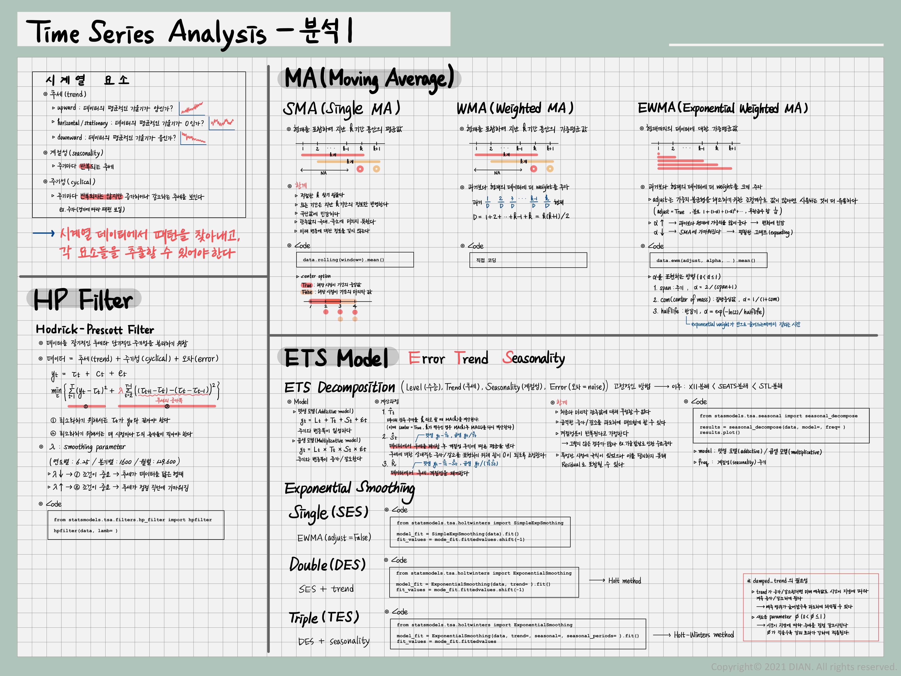
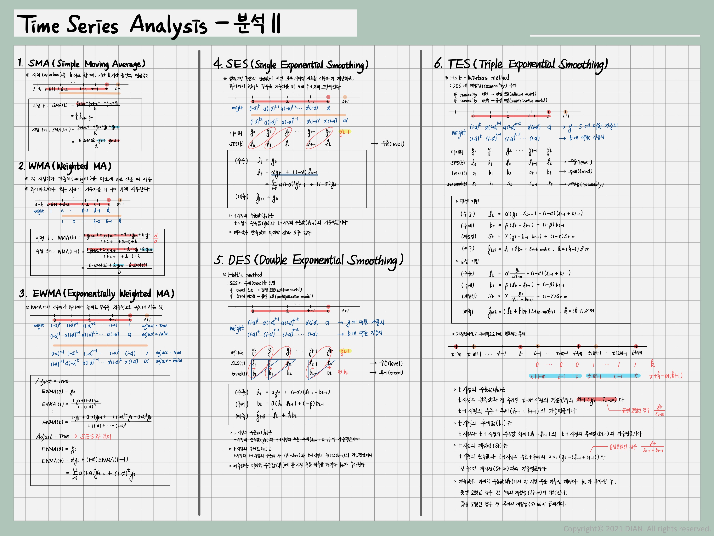

> **Reference** 
> * 시계열 데이터 분석 with 파이썬 강의(Jose Portilla, Udemy)
> * [Forecasting: Principles and Practice](https://otexts.com/fppkr/expsmooth.html)
---

 

 

## **1.시계열 자료의 특징**
1. 시계열 데이터는 추세(Trends)를 갖는다.
* 세가지의 추세로 나뉜다(Upward / Horizontal/Stationary / Downward)
    * Upward : 평균적인 기울기가 대체적으로 양
    * Horizontal/Stationary : 평균적인 기울기가 움직이지 않는다.
    * Downward : 평균적인 기울기가 대체적으로 음

2. 시계열 데이터는 계절성(Seasonality)을 가질 수 있다.(Repeating trends)
* ex. Google Trends - Snowboarding 

3. 시계열 데이터는 순환성(Cyclical)을 가질 수 있다.(Trends with no set repetition)
* 반복성이 없는 순환 요소
* ex. 주가 

## **1.호드릭-프레스콧 필터(Hodrick-Prescott filter)**
$$
    y_t = \tau_t + c_t
$$

    * $y_t$ : time series
    * $\tau_t$ : trend component 
    * $c_t$ : cyclical component

* 이 parameter들은 2차 손실함수를 최소화하는 값으로 결정된다. 이때 $\lambda$는 smoothing parameter(평활화 계수)이다. 
$$
    \min_{\tau_t} \sum_{t=1}^T c_t^2 + 
    \lambda \sum_{t=1}^T[(\tau_t - \tau_{t-1})-(\tau_{t-1}-\tau_{t-2})]^2
$$
    * $\lambda$ : trend component의 증가율 폭을 조절한다.
    * 분기별인 경우 1600, 연간인 경우는 6.25, 월별인 경우는 129,600을 권장한다.

## **1.ETS Model**
* **E**rror-**T**rend-**S**easonality
* 지수평활법(Exponential Smoothing), 추세모형(Trend Methods Models), ETS분해(ETS Decomposition)이 이에 해당한다. 
* ETS 분해: error - trend - seasonality 로 나누는 것
    * 덧셈 모델(additive model) 
    추세가 선형(linear)에 가깝고 계절성이 일정해보일 때 적용할 수 있다.
    * 곱셈 모델(multiplicative model) 
    추세가 지수(exponential)과 같이 비선형적인 경우에 적합하다.

## **1.EWMA Model**
* Exponential Weighted Moving Averages(지수가중이동평균)
* SMA(Simple Moving Averages)
    * 문제점 1.전체 모델이 같은 이동 평균 기간으로 제한된다.
    * 문제점 2. 이동 평균 기간이 짧을수록 시계열 데이터를 잘 설명할 수 있지만 짧은 이동 평균 기간을 이용하면 신호보다 잡음이 커질 수 있다.(적절한 이동평균기간 찾기 어렵다)
    * 문제점 3. 이동 평균 기간만큼 시차(window)가 발생하고, 평균값이다보니 원 데이터의 극소, 극대값에 못미친다.
    * 문제점 4. 실제로 미래 변동에 대해 어떠한 정보도 지니고 있지 않다. 단순히 현재의 일반적 추세만 보여주기 때문이다.
    * 문제점 5. 극단적으로 크거나 작은값이 단순이동평균을 왜곡시킬 수 있다.
* 예전 자료보다 최근 자료에 weight를 주고 싶을 때 사용한다.

## **1.Holt Winters Method**
* EWMA의 한계 : 계절성이나 전반적인 추세 등을 제대로 고려하지 못한다. 하나의 매개변수만 사용하기 때문이다.
* Holt가 1957년 이중 지수 평활법 고안 
Winters가 1960년 계절성을 파악할 수 있도록 확장
* 예측식 + 세 개의 평활식으로 이루어져 있다.
    * 수준 $\alpha\ell_t$, 추세 $\beta b_t$, 계절성 $\gamma s_t$
    * 계절성의 성질에 따라 두 가지로 바뀔 수 있다.
        * 덧셈 기법: 계절성이 전체 데이터에서 일정한 폭으로 나타날 때
        * 곱셈 기법: 계절적 변동폭이 데이터의 수준에 비례해 나타날 때
* 단일 지수 평활법(Single Exponential Smoothing)
    $$
        y_0 = x_0,\quad y_t=(1-\alpha)y_{t-1}+\alpha x_t
    $$
* 이둥 지수 평활법(Double Exponential Smoothing) - 수준 + 추세 
* 삼중 지수 평활법(Triple Exponential Smoothing) - 수준 + 추세 + 계절성

