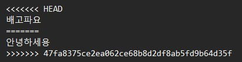

> **Reference**
> * [Git Book, 
https://git-scm.com/book/ko/v2/](
https://git-scm.com/book/ko/v2/)
> * [Git 튜토리얼, https://backlog.com/git-tutorial/kr/](https://backlog.com/git-tutorial/kr/)


# 1. Git에 대한 간단설명
하나의 프로젝트에 여러 버전을 효율적으로 관리할 수 있는 도구이다. 

# 2. Git 생성 및 관리
## 1. git 설치 (https://git-scm.com/downloads)[https://git-scm.com/downloads]
## 2. git 저장소 만들기(repository)
이때 실행 경로는 git으로 관리하고자 하는 폴더에서 진행해야 한다. 

```
> git init
Initialized empty Git repository in D:/yolo8/.git/
```
## 3. git 현재 상황 확인하기
아래 `...` 부분이 빨간색으로 표시되는데, 이는 아직 git에 올라가지 않았음을 의미한다. 

```
> git status
On branch master

No commits yet

Untracted files:
    (use "git add <file>..." to include in what will be commited)
    ...
    ...
    ...
nothing added to commit but untracked files present (use "git add" to track)
```
## 4. `.gitignore` 파일 만들기
내가 git으로 관리하는 폴더이더라도 git에는 안올리고 싶은 파일들이 있을 것이다. 이를 한번에 관리하기 위해 `.gitignore`이라는 파일을 만들고 그 안에 포함하고 싶지 않은 파일들을 한줄에 하나씩 입력한다.

```
> echo 'test' > .gitignore
.gitignore
```

## 5. git 스테이징 영역에 올리기
```
> git add *
```

## 6. git에 올리기(commit)
```
> git commit -m "First Commit"
[master (root-commit) ald7f1f] First Commit
...
...
...
```

> Note! 
> 처음 시도한 경우 commit을 하는데 오류가 나는 경우가 있다. 본인등록을 하면 해결된다. 
>```
> > git config --global user.email "abc@gmail.com"
> > git config --global user.name "name"
>```

# 3. GitHub애 올리기
내가 git으로 관리하고 있는 로컬의 폴더를 GitHub에서 관리하고자 한다. 

## 1. GitHub에서 New Repository 만들기
## 2. New Repository의 주소 복사 

<div>

</div>

## 3. 나의 git을 GitHub에 등록시키기

```
> git remote add origin https://github.com/narae3759/YOLOv8.git 
```

## 4. GitHub에 올리기 
처음 GitHub를 생성한 경우 로그인 팝업창이 뜨게 된다. 그대로 로그인하면 해결된다. 

```
> git push -u origin master
```

> Note! 
> 여기서 master란?      
> * 하나의 Repository에는 여러 branch를 생성해서 사용할 수 있다. 
> * 위의 예시로 보면 master라는 이름으로 branch를 만든 것이다. 

# 4. 기타 주의사항
## 팀프로젝트할때 유의사항 I
같은 파일의 코딩을 수정할 때 충돌하는 경우가 많이 발생한다. 이를 방지하기 위해 수정하기전 다음과 같은 과정이 **꼭 필요하다.** 

```
> git pull origin master
```
### 팀원이 동시에 수정을 했다면?
예를 들어 두 명이 동시 한 파일을 수정한 후 github로 push했다. 그럼 두 개의 수정이 아래 그림과 같이 표현된다.

<div>

</div>

### 만약 과정을 하지 않는다면?
github 저장소의 파일이 변경되었을 때 내 로컬과 다르기 때문에 push를 하면 에러가 나타난다. 
```
! [rejected] master -> master (fetch first)
error: failed to push some refs to "주소"
...
...
...
```

> Note! `git fetch`와 `fit push`의 차이점
> * `git fetch`: 내가 파일을 수정하는 동안 원격 저장소에 내 파일 변화가 있었는지 확인한다. 
> * `git pull`: 내가 파일을 수정하는 동안 원격 저장소에 내 파일 변화가 있다면 그 변화를 내 로컬로 가져온다. 
> 참고사이트 : [공부하는 공작새 블로그](https://chaeyoung2.tistory.com/43)


## 팀프로젝트할때 유의사항 II
한 명이 git 저장소를 만들면 남은 팀원들은 저장소를 로컬로 받아오기만 하면된다. 

```
> git clone "저장소 주소"
```

이 때 git 저장소를 만든 팀원은 Collaborators에 나머지 팀원들을 초대한다. 

<div>

</div>