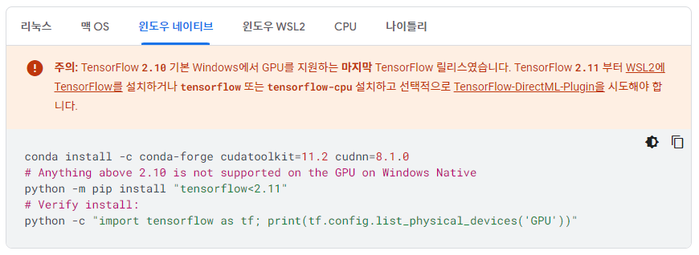

> **Reference**<br>
> * [CPU와 GPU의 차이](https://sdc-james.gitbook.io/onebook/2.-1/1./1.1.1.-cpu-gpu)
> * [TensorFlow 설치 가이드](https://www.tensorflow.org/install/pip?hl=ko#windows-native)
---

# **목차** 
* [CPU와 GPU 설명](#CPU?-GPU?)
* [Anaconda 가상환경 만들기](#Anaconda-가상환경-만들기)

# **CPU? GPU?**

# **Anaconda 가상환경 만들기**

<div>

</div>

## **1) 설치**
### **cudatoolkit [바로가기](https://developer.nvidia.com/cuda-toolkit-archive)**
* 위의 이미지에는 `cudatoolkit=11.2`라고 되어 있지만, 컴퓨터가 Window 11이라 맞지 않는다. 그래서 Window 11에 맞는 `cudatoolkit=11.8`을 설치했다.
* 환경변수 > Path에 경로 추가<br>
`C:\Program Files\NVIDIA GPU Computing Toolkit\CUDA\v11.8\bin`

### **cudnn [바로가기](https://developer.nvidia.com/rdp/cudnn-archive)**
* 회원가입 필수
* 압축 풀기 > cuda 폴더 안의 문서 모두 복사(Ctrl+C)
* 다음 경로에 붙여넣기(Ctrl+V), 덮어쓰기 OK<br>
`C:\Program Files\NVIDIA GPU Computing Toolkit\CUDA\v11.8
`

## **2) 콘다 환경 만들기**
### **1. 'Anaconda Prompt' 실행**
### **2. 새로운 가상환경 생성(ex. myenv)**
```
conda create -name myenv python=3.8
```
### **3. 가상환경 리스트 확인**
```
conda env list
```
### **4. 가상환경 활성화**
```
conda activate myenv
# conda deactivate myenv    # 비활성화
```
### **5. 환경 만들기**
```
conda install -c conda-forge cudatoolkit=11.8 cudnn=8.1.0
pip install "tensorflow<2.11" 
```
* ***! 만약 오류가 났다***<br>
버전을 지정하여 `tensorflow`와 `tensorflow-gpu`를 모두 설치해보자.
### **6. 확인**
```
conda list
```

## **3) 주피터 노트북 실행**
### **1. 주피터 노트북 설치**
```
pip install jupyter notebook
```
### **2. kernel 연결**
```
python -m ipykernel install --user --name myenv
```
### **3. 주피터 노트북 열기**
```
jupyter notebook
```

#### ※ 주피터 노트북에서 GPU 확인하기
```
import os
import tensorflow as tf

print(tf.__version__)

tf.config.list_physical_devices('GPU')
```
