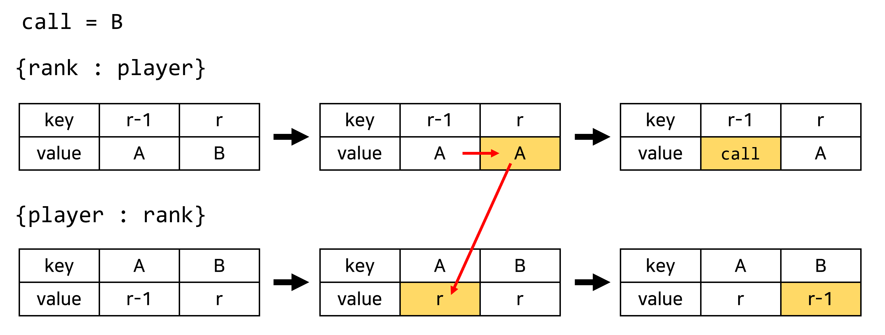

# **[프로그래머스 Lv1] 달리기 경주**

> 출처: 프로그래머스 코딩 테스트 연습, https://programmers.co.kr/learn/challenges, 
[문제 링크](https://school.programmers.co.kr/learn/courses/30/lessons/178871) 

### 문제 설명

<p>얀에서는 매년 달리기 경주가 열립니다. 해설진들은 선수들이 자기 바로 앞의 선수를 추월할 때 추월한 선수의 이름을 부릅니다. 예를 들어 1등부터 3등까지 "mumu", "soe", "poe" 선수들이 순서대로 달리고 있을 때, 해설진이 "soe"선수를 불렀다면 2등인 "soe" 선수가 1등인 "mumu" 선수를 추월했다는 것입니다. 즉 "soe" 선수가 1등, "mumu" 선수가 2등으로 바뀝니다.</p>

<p>선수들의 이름이 1등부터 현재 등수 순서대로 담긴 문자열 배열 <code>players</code>와 해설진이 부른 이름을 담은 문자열 배열 <code>callings</code>가 매개변수로 주어질 때, 경주가 끝났을 때 선수들의 이름을 1등부터 등수 순서대로 배열에 담아 return 하는 solution 함수를 완성해주세요.</p>

<hr>

<h5>제한사항</h5>

<ul>
<li>5 ≤ <code>players</code>의 길이 ≤ 50,000

<ul>
<li><code>players[i]</code>는 i번째 선수의 이름을 의미합니다.</li>
<li><code>players</code>의 원소들은 알파벳 소문자로만 이루어져 있습니다.</li>
<li><code>players</code>에는 중복된 값이 들어가 있지 않습니다.</li>
<li>3 ≤ <code>players[i]</code>의 길이 ≤ 10</li>
</ul></li>
<li>2 ≤ <code>callings</code>의 길이 ≤ 1,000,000

<ul>
<li><code>callings</code>는 <code>players</code>의 원소들로만 이루어져 있습니다.</li>
<li>경주 진행중 1등인 선수의 이름은 불리지 않습니다.</li>
</ul></li>
</ul>

<hr>

<h5>입출력 예</h5>
<table class="table">
        <thead><tr>
<th>players</th>
<th>callings</th>
<th>result</th>
</tr>
</thead>
        <tbody><tr>
<td>["mumu", "soe", "poe", "kai", "mine"]</td>
<td>["kai", "kai", "mine", "mine"]</td>
<td>["mumu", "kai", "mine", "soe", "poe"]</td>
</tr>
</tbody>
      </table>
<hr>

<h5>입출력 예 설명</h5>

<p>입출력 예 #1</p>

<p>4등인 "kai" 선수가 2번 추월하여 2등이 되고 앞서 3등, 2등인 "poe", "soe" 선수는 4등, 3등이 됩니다. 5등인 "mine" 선수가 2번 추월하여 4등, 3등인 "poe", "soe" 선수가 5등, 4등이 되고 경주가 끝납니다. 1등부터 배열에 담으면 ["mumu", "kai", "mine", "soe", "poe"]이 됩니다.</p>

# **문제 풀이**
## 📌**핵심**
* `index()`, `remove()`, `pop()`, `insert()`를 쓰지 않고, 효율성을 높이는 것.<br>
***왜?*** 불려진 선수가 어디있는지 리스트의 처음 요소부터 비교하면서 찾는 과정이므로, <br>만약 몇 백명이 참가하는 마라톤에 적용할 경우 찾는데 시간이 너무 오래 걸린다.
* 시간 복잡도(Time Complexity)를 고려해야 하는 문제

## 📌**해결 방법** : 딕셔너리(dictionary)이용
* `{rank: player}`와 `{player: rank}` 딕셔너리를 이용해서 <br>
calling된 player만 즉시 찾아서 앞 순위의 사람의 순위만 바꾸도록 한다. 
* **STEP1**. 해설진이 부른 선수의 순위를 찾는다. (`rank`)
* **STEP2**. 불려진 선수와 앞 순위 선수의 `{rank: player}`를 변경한다.
   * 불려진 선수의 순위의 value에 앞 순위 선수의 value로 바꾼다.
   * 앞 순위의 value에 불려진 선수로 바꾼다.
* **STEP3**. 불려진 선수와 앞 순위 선수의 `{player: rank}`를 변경한다.
   * 불려진 선수의 value를 `rank - 1`로 바꾼다.
   * 앞 순위 선수의 value에 `rank`로 바꾼다.

<div markdown="1" style="text-align:center;">

</div>

## 📌**Python 코드**
```python
def solution(players, callings):
    # {rank : player}
    rank_player = dict([(i+1, p) for i, p in enumerate(players)])
    # {player : rank}
    player_rank = dict([(p, i+1) for i, p in enumerate(players)])
    
    for call in callings:
        # 1. 해설진이 부른 선수의 rank 찾기
        rank = player_rank[call]
        
        # 2. 앞 선수와 불려진 선수의 {rank : player} 변경
        rank_player[rank] = rank_player[rank-1]
        rank_player[rank-1] = call
        
        # 3. 앞 선수와 불려진 선수의 {player : rank} 변경
        player_rank[call] = rank - 1
        player_rank[rank_player[rank]] = rank
        
    answer = list(rank_player.values())
    return answer
```
