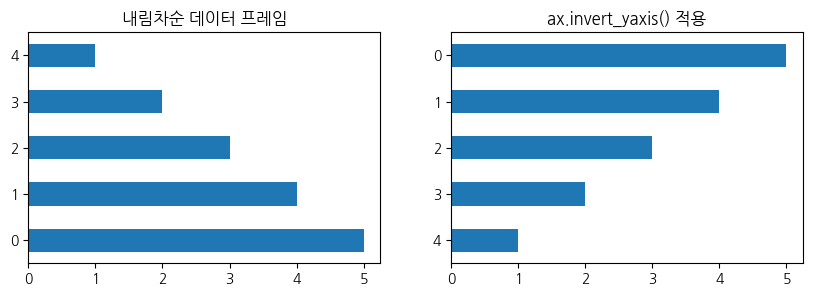

```python
import matplotlib.pyplot as plt 
```
# **`axis`**
### `ax.axis('off')`
모든 축을 그리고 싶지 않을 때에는 로 표현할 수 있다. 이미지를 나타낼 때 주로 사용한다. 

### `set_title(title, pad, fontweight, size)`
plot의 title을 설정할 때 가장 많이 사용하는 것이 **bold, fontsize**이다. 또한, title이 가끔 그림과 붙어 있어 사이의 space를 조정하고 싶을 때가 있는데 **pad**로 조정할 수 있다. 3종 세트로 기억하자.

# **`plt.subplots()`**

```python
fig, ax = plt.subplots(nrow, ncol, figsize, options...)

# pandas dataframe을 통한 plot
df.plot(ax=ax[i,j])

# ax를 통한 plot
ax[i,j].plot()
```

* plot의 배치가 1행 또는 1열인 경우에는 `ax[i]`로 표현한다.
* plots 비율 조정 : `gridspec_kw={'height_ratios':[3,1]}`<br>
: top plot과 bottom plot의 height 비율을 2:1로 한다. 
* plots의 축 공유 : `sharex=True, sharey=True`

# **`dataframe.plot().bar() / dataframe.plot().barh()`**

## **1) options**

```python
df.plot().barh(ax, title, rot,....)
```
* `width / height`<br>
막대의 폭을 조정할 수 있다.
* `rot` <br>
default로 x축의 label이 왼쪽으로 90도 회전되어 있는 형태로 되어 있다. <br>
이를 수정하기 위해 `rot=0`으로 조정할 수 있다. <br>
label의 길이가 길어서 겹치는 경우 `rot=45`로 기울여서 표현하기도 한다.

## **2) ax.invert_yaxis()**

```python
df.plot().barh(ax=ax)
ax.invert_yaxis()
```

* pandas에서 가로 막대 그래프를 그리게 되면 dataframe의 index와 매칭되어 표현된다. <br>
만약 dataframe이 내림차순 되어 있는 상태라면 `barh()`를 그렸을 때, 가장 높은 값이 아래에 있게 된다. 이를 조정하기 위해 사용된다.

<div markdown="1" style="text-align:center;">

<details>
<summary>그림 코드</summary>
<div markdown="1" style="text-align:left">

```python
df = pd.DataFrame([5, 4, 3, 2, 1])

fig, ax = plt.subplots(1, 2, figsize=(10, 3))

df.plot.barh(ax=ax[0], legend=None, title='내림차순 데이터 프레임')
df.plot.barh(ax=ax[1], legend=None, title='ax.invert_yaxis() 적용')
ax[1].invert_yaxis()
```
</div>     
</details>
</div>  


