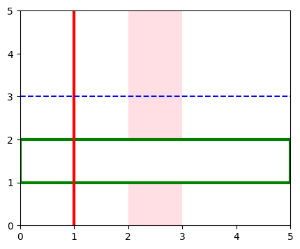
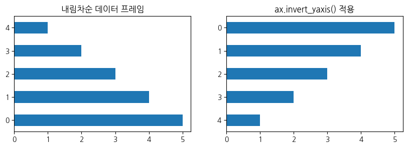

# **목차** 
* [line, area 추가하기](#axvlineaxhlineaxvspanaxhspan)
* [Bar/Barh 그래프](#dataframeplotbarbarh)


# **`axvline/axhline/axvspan/axhspan()`**

* `axvline/axhline` : 그래프에 세로/가로선을 추가한다.
* `axvspan/axhspan` : 그래프에 세로/가로 영역을 추가한다.

```python
fig, ax = plt.subplots(figsize=(5,4))

ax.set(xlim=(0,5), ylim=(0,5))
ax.axvline(x=1, linewidth=3, color='red')
ax.axhline(y=3, linestyle='--', color='blue')
ax.axvspan(xmin=2, xmax=3, facecolor='pink', alpha=0.5)
ax.axhspan(ymin=1, ymax=2, edgecolor='green', facecolor='white', linewidth=3)
```




# **`dataframe.plot().bar()/barh()`**

## **1) options**

```python
df.plot().barh(ax, title, rot,....)
```
* `width / height`<br>
막대의 폭을 조정할 수 있다.
* `rot` <br>
default로 x축의 label이 왼쪽으로 90도 회전되어 있는 형태로 되어 있다. <br>
이를 수정하기 위해 `rot=0`으로 조정할 수 있다. <br>
label의 길이가 길어서 겹치는 경우 `rot=45`로 기울여서 표현하기도 한다.

## **2) ax.invert_yaxis()**

```python
df.plot().barh(ax=ax)
ax.invert_yaxis()
```

* pandas에서 가로 막대 그래프를 그리게 되면 dataframe의 index와 매칭되어 표현된다. <br>
만약 dataframe이 내림차순 되어 있는 상태라면 `barh()`를 그렸을 때, 가장 높은 값이 아래에 있게 된다. 이를 조정하기 위해 사용된다.

<div markdown="1" style="text-align:center;">

<details>
<summary>그림 코드</summary>
<div markdown="1" style="text-align:left">

```python
df = pd.DataFrame([5, 4, 3, 2, 1])

fig, ax = plt.subplots(1, 2, figsize=(10, 3))

df.plot.barh(ax=ax[0], legend=None, title='내림차순 데이터 프레임')
df.plot.barh(ax=ax[1], legend=None, title='ax.invert_yaxis() 적용')
ax[1].invert_yaxis()
```
</div>     
</details>
</div>  
