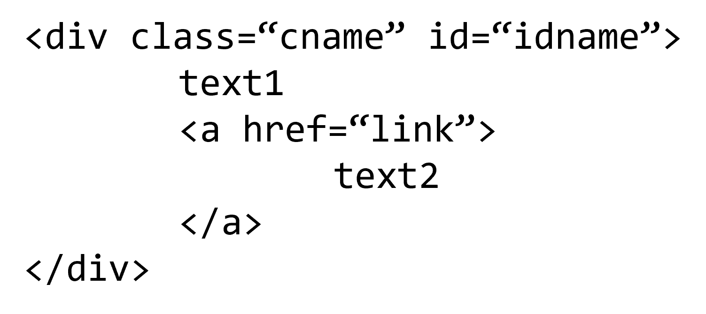

> **웹에서 HTML보기**
> - 단축키 : F12 / Ctrl+Shift+I
> - [설정] - [도구 더보기] - [개발자 도구]
> - [마우스 오른쪽 버튼] - [검사]
---

# **1. scraping**

```python
import pandas as pd

tables = pd.read_html(url, encoding=)
```
* encoding : utf-8, CP949
* table 형태가 있을 때 가능. List 형태만 있을 때에 오류 발생

# **2. crawling**

> <b>URL 조작</b><br>
> 검색어에 따라 URL이 달라지는 경우가 있다. <br>
이러한 경우 내가 웹사이트에서 조작하지 않아도 python코드에서 웹 페이지 이동을 할 수 있다.

## **1) BeautifulSoup**

### **HTML 추출**
* `response.status`: 정상은 200, 에러면 404 / 406 ...
1. `urllib.request`
    * 기본

        ```python
        from urllib.request import urlopen, Request

        url = 'https://www.melon.com/chart/index.htm'

        request = Request(url)
        with urlopen(request) as response:
            print(response.status)
            html = response.read().decode('utf-8')
            print(html)
        ```
    * Error : <u>HTTP Error 406: Not Acceptable</u><br>
    외부에서 접근하는 것에 민감한 사이트들은 `headers`가 필요하다.<br>
    현재 사용자가 어떤 클라이언트(ex.크롬)를 통해 요청을 보냈는지 알 수 있다. 

        ```python
        from urllib.request import urlopen, Request

        url = 'https://www.melon.com/chart/index.htm'
        headers = {'User-Agent':'Mozilla/5.0 (Windows NT 6.1; Win64; x64)'}

        request = Request(url, headers=headers)
        with urlopen(request) as response:
            print(response.status)
            html = response.read()
            print(html)
        ```
2. `requests`

    ```python
    import requests as req

    url = 'https://www.melon.com/chart/index.htm'
    headers = {'User-Agent':'Mozilla/5.0 (Windows NT 6.1; Win64; x64)'}

    response = req.get(url, headers=headers)
    response.text
    ```

### **정보 추출**

```python
from bs4 import BeautifulSoup

soup = BeautifulSoup(html, 'html.parser')  
soup.prettify()
```
* `soup.prettify()`: html에 indent를 줘서 더 보기 좋게 출력되게 한다.


> HTML 간단 이해
> * 어떤 구역을 `< >`을 통해 구분하는데 그 구역의 이름을 <b>태그(tag)</b>라고 한다.
> * 태그에 id, class 등 태그를 설명하는 것들이 있는데 이를 <b>속성(attr)</b>이라고 한다.

<div markdown="1" style="text-align:center">

</div>  

* 위의 html의 이름을 soup이라고 하자.
1. 기본
    * `soup.태그이름` : 해당 태그를 출력한다.<br>     
        ```python
        soup.a

        ## <a href="link">
        ## text2
        ## </a>
        ```
    * `soup[속성]` : 해당 태그의 속성 값을 출력한다.<br> 
        ```python
        soup['class']       # cname
        soup.a['href']      # link
        ```
    * `soup.attrs` : 해당 태그의 속성들을 dictionary로 출력한다.<br>
        ```python
        soup.attrs          # {'class': 'cname', 'id': 'idname'}
        ```
    * `soup.text` : 해당 태그 안에 있는 text를 출력한다.<br>
        ```python
        soup.text           # \ntext1 \ntext2\n\n\n
        ```
2. find(한 개) / find_all(모두)
    * `soup.find_all(태그이름, class_=클래스값, id=id값)`
    * `soup.find_all(태그이름, attrs={'class':클래스값, 'id':id값})`

3. select_one(한 개) / select(모두)
    * `soup.select('태그이름.class값#id값')`
    * `soup.select('경로')`<br>
    경로는 개발자도구에서 해당 html 코드를 선택 후<br>
    [마우스 오른쪽 클릭] - [Copy] - [Copy Selector]로 쉽게 얻을 수 있다.
    * 만약 값에 띄어쓰기(space)가 있는 경우에는 '.'으로 대체하여 쓰면 된다.

## **1) Selenium**